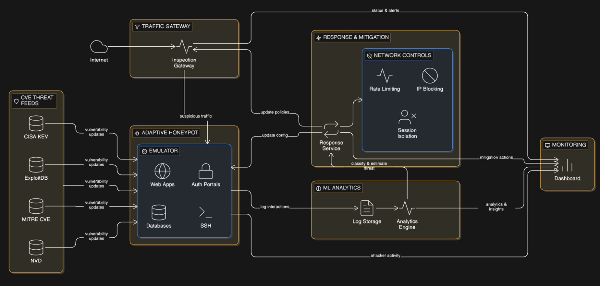

# 🛡️ Adaptive Honeypot ML System (CAPSTONE)

An intelligent, self-evolving cybersecurity system that detects, deceives, and adapts to real-world attacks using Machine Learning and threat intelligence.

---

## 🚀 Overview

This project is an **AI-driven adaptive honeypot framework** designed to:

* Intercept malicious traffic
* Classify attackers in real-time
* Dynamically deploy realistic honeypots
* Learn from attacker behavior
* Automatically respond with mitigation strategies

Think of it as a **trap that learns how to trap better** every time someone falls into it.

---

## 🧠 Core Idea

Traditional honeypots are static.
Attackers evolve. Systems must evolve faster.

This system combines:

* 📡 Traffic inspection
* 🧬 Threat intelligence (CVE feeds)
* 🤖 Machine learning (CNN + LSTM)
* 🎭 Dynamic honeypots (SSH, Web, DB emulation)
* 🚨 Automated response mechanisms

---

## 🏗️ System Architecture

The system follows a **closed-loop adaptive security pipeline**, where every attack improves the defense.



---

## 📁 Project Structure

```
adaptive-honeypot-ml-CAPSTONE/
│
├── traffic_gateway/        # Intercepts & routes traffic
├── cve_intelligence/       # CVE ingestion & analysis
├── adaptive_honeypot/      # Dynamic honeypot system
├── ml_analytics/           # ML models & feature extraction
├── response_mitigation/    # Automated defense actions
├── monitoring/             # Dashboard & alerts
│
├── shared/                 # Common models & utilities
├── notebooks/              # Experiments & EDA
├── docker/                 # Deployment configs
├── docs/                   # Documentation
│
├── main.py                 # Entry point
├── config.yaml             # Global configuration
└── requirements.txt
```

---

## ▶️ Getting Started

### 1. Clone the Repository

```bash
git clone https://github.com/YOUR_USERNAME/adaptive-honeypot-ml-CAPSTONE.git
cd adaptive-honeypot-ml-CAPSTONE
```

### 2. Install Dependencies

```bash
pip install -r requirements.txt
```

---

# 🚦 Module 1 Demo: Traffic Gateway (Stage 1)

This demo showcases:

* Traffic interception
* Zero-trust routing
* Honeypot redirection
* Rate limiting and blocking
* Live monitoring dashboard

---

## ⚙️ Step 1 — Start Fake Honeypot

```bash
python fake_web.py
```

Expected:

```
Running on http://127.0.0.1:8081
```

---

## ⚙️ Step 2 — Start Traffic Gateway

```bash
python -m traffic_gateway.inspection_gateway
```

Expected:

```
[GATEWAY_STARTED]
honeypots=['web://127.0.0.1:8081']
```

---

## ⚙️ Step 3 — Start Live Dashboard

```bash
python dashboard/backend.py --host 0.0.0.0
```

Open in browser:

```
http://localhost:5000
```

---

## 🌐 Step 4 — Send Traffic (Local Test)

```bash
curl http://localhost:8080/
```

Expected logs:

```
[CONN_RECEIVED]
[CONN_ROUTED → honeypot]
[PROXY_CONNECTED]
[CONN_CLOSED]
```

---

## 💻 Step 5 — Multi-Laptop Demo (LAN Setup)

Find your IP:

```bash
ipconfig
```

Example:

```
192.168.1.5
```

From other laptops:

```bash
curl http://192.168.1.5:8080/
```

---

## 🔥 Step 6 — Simulate Attack (Rate Limiting)

```bash
for /l %i in (1,1,30) do curl http://192.168.1.5:8080/
```

Expected:

```
[RATE_LIMITED]
[CONN_REJECTED]
```

---

## 🎯 What This Demonstrates

* All incoming traffic is intercepted
* Zero-trust model routes suspicious traffic to honeypot
* Transparent proxy simulates real service
* Session data is logged for ML pipeline
* Repeated requests trigger automatic blocking

---

## ⚠️ Backup (Dashboard Demo Mode)

```bash
python dashboard/backend.py --demo
```

---

## 🧠 Key Concept

> Traffic → Gateway → Classification → Honeypot → Logging → Scoring → Blocking

---

## 📈 Future Enhancements

* Reinforcement learning for adaptive defense
* Distributed honeypot network
* LLM-based attack interpretation
* SIEM integration

---

## 🎯 Use Cases

* Cybersecurity research
* Intrusion detection systems
* Red team / blue team simulations
* Academic capstone projects

---
